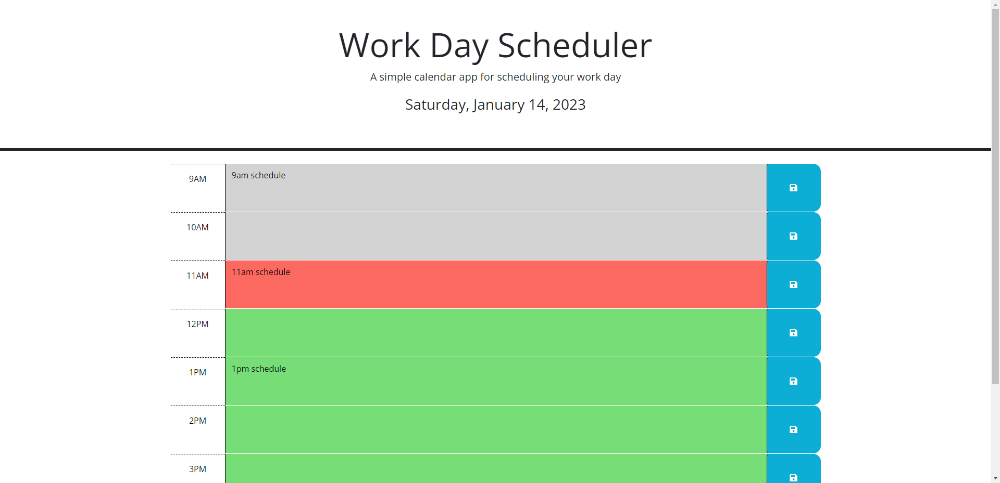

# Work Day Scheduler
A simple calendar application that allows user to save events for each hour of the day to manage user time effectively.

## Description
A daily planner to create a schedule as follows:
- Current day is displayed at the top of the calendar.
- A timeblock for each standard business hour is displayed.
- Each timeblock is color coded to indicate whether it is in the past, present or future.
- Enter an event in each timeblock.
- Click save button to save the event.
- Events are saved into local storage.
- When the page is refreshed, events persist.

## Deployment
The webpage is deployed to GitHub pages. Use below link to visit the webpage: https://nileshpatel83.github.io/Work-Day-Scheduler/

## Screenshot

## License
Please refer to the LICENSE in the repo.
